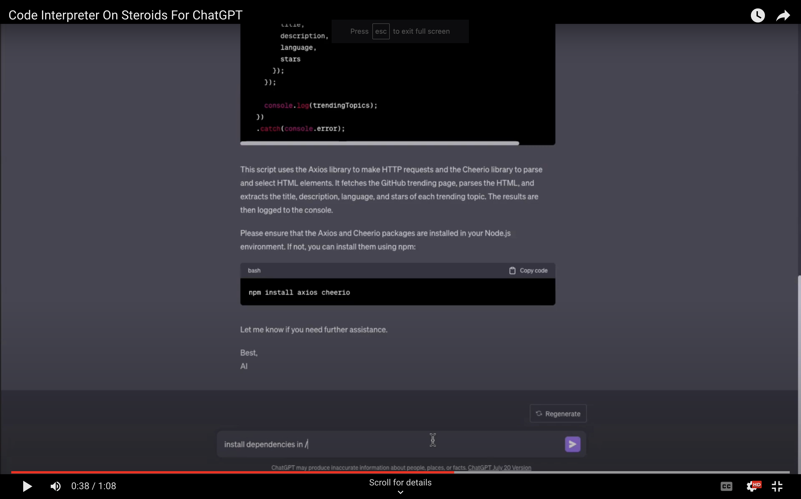

  <h1 align="center">Code Interpreter on steroids for ChatGPT (by e2b)</h1>
	<p align="center">
		<a href="https://discord.gg/U7KEcGErtQ" target="_blank">
			
		</a>
		<a href="https://twitter.com/e2b_dev" target="_blank">
			
		</a>
	</p>


<p align="center">
Click on the image to watch the demo
</p>

[](https://www.youtube.com/watch?v=kJuJnsatU2s?utm_source=github)

[E2B](https://e2b.dev/) plugin for ChatGPT is like **code interpreter on steroids**.

We give your ChatGPT instance access to a full cloud environment that's sandboxed. That means:
- Access to Linux OS
- Using filesystem (create, list, and delete files and dirs)
- Run processes
- Sandboxed - you can run any code
- Access to the internet

These cloud instances are meant to be used for agents. Like a sandboxed playgrounds, where the agent can do whatever it wants.

## ❓ What can I do with this plugin?
This plugin exposes 3 simple commands (see the [OpenAPI file](https://github.com/e2b-dev/chatgpt-plugin/blob/main/openapi.yaml)):
- `RunCommand`
  - Runs any shell command
- `ReadFile`
  - Reads file on path
- `WriteFile`
  - Writes content to a file on a path
These simple 3 primitives enable a whole set of possibilities. 

Here is a few ideas what you can do with these commands:
- Run **any** language, not just Python. Currently supported out of the box:
  - Nodejs
  - Go
  - Bash
  - Rust
  - Python3
  - PHP
  - Java
  - Perl
  - .NET

  Please open an issue if you want us to support another language

- Run databases
- Start servers
- Run terminal commands
- Create long running processes
- Deploy websites
- Install programs via terminal

## 💻 Installation
There are two ways:
1. Wait for OpenAI to approve our plugin in their store
2. Have developer access to ChatGPT plugins and install the plugin by following the instructions below for how to [run plugin locally](#how-to-run-plugin-locally)

### How to run plugin locally
To install the required packages for this plugin, run the following command:

```bash
npm install
```

To run the plugin, enter the following command:

```bash
npm run dev
```

Once the local server is running:

1. Navigate to https://chat.openai.com.
2. In the Model drop down, select "Plugins" (note, if you don't see it there, you don't have access yet).
3. Select "Plugin store"
4. Select "Develop your own plugin"
5. Enter in localhost:3000 since this is the URL the server is running on locally, then select "Find manifest file".

## 🤖 Usage examples
> Install youtube-dl and use it to download this video https://www.youtube.com/watch?v=jNQXAC9IVRw

> Start HTTP server on port 3000

> Clone this repo "https://github.com/e2b-dev/chatgpt-plugin", fix any typos in readme push it

## 📂 How to upload & download files
The official ChatGPT Code Interpreter supports uploading and downloading files. While the e2b code interpreter doesn't support this functionality natively (yet), you can "hack" around it just by using the `curl` or `wget` command and a service such as the S3 bucket.

### Uploading your files to plugin
1. Get S3 bucket (or any alternative)
2. Upload your files there and make them public
3. Tell ChatGPT to download that files using curl

> Right now the URL needs to be just http, not https.

### Downloading files from plugin
1. Tell ChaGPT to upload its files to S3 bucket using curl

> Right now the URL needs to be just http, not https.

## What is e2b?
[E2B](https://www.e2b.dev/) is the company behind this plugin. We're building an operating system for AI agents. A set of low-level APIs for building agents (debugging, auth, monitor, and more) together with sandboxed cloud environments for the agents where the agents can roam freely without barriers 🐎.


## Development
Install dependencies:
```bash
npm install
```

Then start reloading server by running:
```bash
npm run dev
```

### API routes
We are using [tsoa](https://github.com/lukeautry/tsoa) to generate [OpenAPI spec](./openapi.yaml) and to generate server route boilerplate. It uses TypeScript decorators to describe the API.

Edit the Controllers in [`src/plugin`](./src/plugin/) to modify the API exposed to the plugin.

### Documentation
The documentation of API in the OpenAPI spec is generated from the JSDoc comments in the Controllers. See [tsoa docs](https://tsoa-community.github.io/docs/descriptions.html) for more info.

The info section inside of OpenAPI spec is injected in the [script that reformats the generated spec](./scripts/formatSpec.js) so if you want to change it, you need to change it there not by changing the `openapi.yaml` file directly.

### Manifest
You may also want to modify the [ChatGPT plugin manifest](./.well-known/ai-plugin.json) to change metadata about the plugin.
